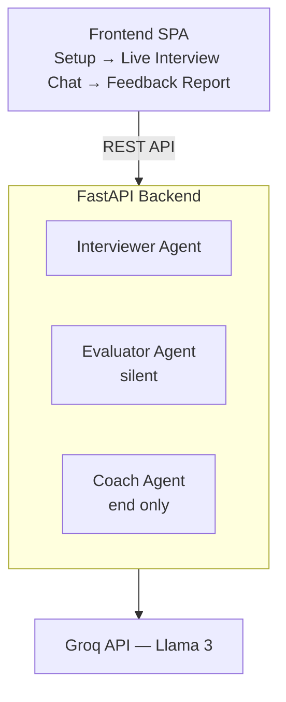

# AI Mock Interview Coach

A multi-agent AI system that conducts realistic mock interviews and provides structured, actionable feedback. Built with FastAPI, vanilla JS, and the Groq API (Llama 3).

---

## Architecture Overview



### Agent Descriptions

| Agent | Role | Input | Output |
|-------|------|-------|--------|
| **Interviewer** | Conducts the live interview (up to 10 turns) | Role, background, focus area, conversation history | Next question or closing statement |
| **Evaluator** | Silently scores each answer after every turn | Question, answer, role | JSON with scores (1–5) across 4 dimensions |
| **Coach** | Generates the final feedback report | Full transcript + all evaluations | Markdown report: strengths, gaps, action items |

### Orchestration Flow

1. User fills out setup form → `POST /start` → Interviewer generates opening question
2. User answers → `POST /answer`:
   - Evaluator silently scores the answer (JSON, not shown to user)
   - Interviewer reads full conversation history and decides: follow up, probe deeper, or move on
3. After ~10 turns (or when Interviewer says "That wraps up our interview"), `interview_done: true` is returned
4. User clicks "View Feedback" → `POST /feedback` → Coach reads the full transcript + all evaluations and generates a structured markdown report

---

## Setup Instructions

### Prerequisites

- Python 3.10+
- A free [Groq API key](https://console.groq.com)

### Installation

```bash
# Navigate to the project directory
cd ai-mock-interview-coach

# Create a virtual environment (recommended)
python -m venv venv

# Activate it
# Windows:
venv\Scripts\activate
# macOS/Linux:
source venv/bin/activate

# Install dependencies
pip install -r requirements.txt
```

### Set your API key

Create a `.env` file in the project root:

```
GROQ_API_KEY=your-api-key-here
```

Or export it directly:

```bash
# Windows (PowerShell)
$env:GROQ_API_KEY = "your-api-key-here"

# macOS/Linux
export GROQ_API_KEY="your-api-key-here"
```

### Run the app

```bash
uvicorn main:app --reload
```

Open [http://localhost:8000](http://localhost:8000) in your browser.

> **Note:** The free Groq tier has a 100K tokens/day limit on `llama-3.3-70b-versatile`. If you hit it, switch `MODEL_NAME` in `main.py` to `"llama-3.1-8b-instant"` (500K TPD limit).

---

## API Endpoints

| Method | Endpoint | Body | Returns |
|--------|----------|------|---------|
| `GET` | `/` | - | Frontend HTML |
| `GET` | `/health` | - | `{ "status": "ok" }` |
| `POST` | `/start` | `{ role, background, focus_area }` | `{ session_id, message, turn }` |
| `POST` | `/answer` | `{ session_id, answer }` | `{ message, turn, interview_done }` |
| `POST` | `/feedback` | `{ session_id }` | `{ feedback_markdown }` |
| `POST` | `/transcribe` | `audio` (multipart) | `{ transcript }` |

---

## File Structure

```
ai-mock-interview-coach/
├── main.py              # FastAPI app, agent functions, orchestration
├── index.html           # Complete frontend (HTML + CSS + JS, single file)
├── requirements.txt     # Python dependencies
├── .env                 # API key (not committed)
├── prompts/
│   ├── interviewer.txt  # Interviewer agent system prompt
│   ├── evaluator.txt    # Evaluator agent system prompt
│   └── coach.txt        # Coach agent system prompt
└── README.md
```

---

## Key Design Decisions & Tradeoffs

### 1. Groq + Llama 3 over OpenAI/Gemini
Groq's inference is extremely fast (tokens/sec far exceeds OpenAI on comparable models), which matters for a live interview feel. The tradeoff is the free tier's daily token limit — solved by falling back to `llama-3.1-8b-instant` for development/testing.

### 2. Evaluator runs silently, every turn
The Evaluator scores each answer immediately after it's given rather than waiting until the end. This means the Coach has granular per-turn data (scores + justifications) rather than having to re-read the whole transcript cold. The tradeoff is an extra LLM call per turn, which adds ~1–2s latency and costs tokens. For a prototype this is acceptable; in production you'd batch or cache.

### 3. In-memory session store
Sessions are stored in a plain Python dict. This is intentional for a prototype — no database dependency, zero config. The tradeoff is that sessions are lost on server restart and the system can't scale horizontally. A Redis or Postgres session store would be the natural upgrade path.

### 4. Interviewer uses full conversation history each turn
Rather than summarising the conversation, the Interviewer receives the full message history on every call. This gives it perfect context for natural follow-ups and prevents it from repeating questions. The tradeoff is growing context length over a 10-turn interview — acceptable for Llama 3's 128K context window.

### 5. End-of-interview detection via string match
The interview is marked done when the Interviewer's response contains "that wraps up our interview" (case-insensitive), or when `turn_count > MAX_QUESTIONS`. This is simple and works reliably because the Interviewer prompt instructs the model to use exactly that phrase. A more robust approach would use a structured output field (`{ "done": true }`), but that adds a JSON parsing step and another prompt constraint.

### 6. Single-file frontend
The entire frontend lives in `index.html` — no build step, no bundler, no dependencies beyond Google Fonts. This makes deployment trivial (FastAPI just serves the file) and keeps the codebase focused on the AI logic. The tradeoff is that the file is long; in a production app this would be split into components.

---

## Example Interview Transcripts

### Transcript 1 — Strong Candidate (Product Manager role, Behavioral)

> **AI:** I'm your interviewer today. We're here to explore your fit for a Product Manager role. Let's start with a classic: tell me about a time you had to make a difficult product decision with incomplete data. Walk me through your thinking.
>
> **Candidate:** Sure. At my last internship we had to decide whether to ship a new onboarding flow before we had statistically significant A/B test results — we were two weeks from a major partnership launch. I pulled together what data we had: a 12% drop in day-1 retention on the control, qualitative feedback from 8 user interviews all pointing the same direction, and a competitor who had shipped something similar six months prior. I recommended shipping with a feature flag so we could roll back instantly, and we set a 72-hour metric watch. Retention improved 9% in the first week and we kept it live. In retrospect I'd have started the test a week earlier, but the decision framework held up.
>
> **AI:** That's a well-structured answer. The feature flag decision shows good risk management instinct. Let me probe one layer deeper — what would you have done if the 72-hour metrics had gone the other direction? Did you have a rollback plan beyond "turn off the flag"?
>
> **Candidate:** Yes - we had a communication plan drafted for the partnership team, and I'd already talked to engineering about the rollback procedure so it was a 15-minute operation, not a crisis. The harder question would have been whether to delay the partnership launch or ship the old flow. I think we would have shipped the old flow; a bad first impression at scale is worse than a delayed launch.
>
> **AI:** Good. That shows you thought through second-order consequences. Let's shift to a different area...

*Result: Strong answers, Evaluator scores 4–5/5 across all dimensions, Coach feedback highlights structured thinking and risk management as strengths.*

---

### Transcript 2 — Weak Candidate (Data Analyst role, Technical)

> **AI:** Welcome. Let's jump into the technical side of a Data Analyst role. Can you walk me through how you'd approach cleaning a dataset that has ~15% missing values in a key numeric column?
>
> **Candidate:** I'd probably just delete the rows with missing values.
>
> **AI:** That's one option — when would that be the right call versus potentially problematic?
>
> **Candidate:** I'm not sure, I'd just do it and see what happens.
>
> **AI:** Understood. Let's try a different angle — have you worked with any data manipulation libraries? Python, R, SQL?
>
> **Candidate:** I've used Excel a bit.
>
> **AI:** Okay. Let's talk about something more conceptual then. If you had a dataset of customer transactions and your manager asked you to "find something interesting," how would you start?
>
> **Candidate:** I'd look at the numbers and see if anything stands out.

*Result: Evaluator consistently scores 1–2/5. Coach feedback is direct: gaps in statistical fundamentals, no technical tooling experience, vague reasoning. Action items include specific resources to study.*

---

### Transcript 3 — Tricky/Edge Case (Frontend Engineer, candidate goes off-topic)

> **AI:** Let's start with a technical question. Can you explain the difference between `==` and `===` in JavaScript?
>
> **Candidate:** Actually I wanted to ask — is this interview going to cover system design? I've been preparing for that and I'm more comfortable there.
>
> **AI:** We'll cover a mix of areas. For now, let's stick with the JavaScript question — this one's foundational and will give me useful signal regardless of the role level.
>
> **Candidate:** Ok fine. `==` checks value and `===` checks value and type.
>
> **AI:** Close — you have it slightly backwards. `===` is the strict equality operator that checks both value and type, while `==` does type coercion first. Can you give me an example where this difference would actually matter in code?
>
> **Candidate:** I don't know, maybe comparing a string and a number?
>
> **AI:** Exactly right — `"5" == 5` is true in JS because of coercion, but `"5" === 5` is false. Good. Let's move to something closer to what you prepared — walk me through how you'd design the component architecture for a real-time collaborative text editor.

*Result: Interviewer handles redirection gracefully, corrects a factual error without dismissing the candidate, and pivots to their stated strength area. Evaluator notes partial credit on the JS question. Coach highlights knowledge gaps in fundamentals but recognises stronger system design reasoning.*

---

## Tech Stack

- **Backend:** Python 3.10+ / FastAPI
- **Frontend:** Vanilla HTML, CSS, JavaScript (single file, no build step)
- **AI Model:** Llama 3.3 70B / Llama 3.1 8B via Groq API
- **Speech-to-text:** Whisper Large v3 via Groq API
- **State:** In-memory session storage (no database required)
